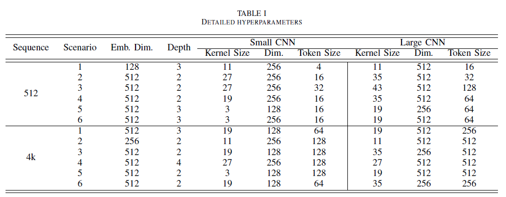

# A Cross-Attention Multi-Scale Performer with Gaussian Bit-Flips for File Fragment Classification

\[Under Review\]

Authors: Jeong Gyu Park*, Sisung Liu*, Hyeongsik Kim, Je Hyeong Hong 
(* means co-first authors)

## Abstract
File fragment classification is a crucial task in digital forensics and cybersecurity, and has recently achieved significant improvement through the deployment of convolutional neural networks (CNNs) compared to traditional handcrafted feature-based methods. However, CNN-based models exhibit inherent biases that can limit their effectiveness for larger datasets. To address this limitation, we propose the Cross-Attention Multi-Scale Performer (XMP) model, which integrates the attention mechanisms of transformer encoders with the feature extraction capabilities of CNNs. Compared to our conference work, we additionally introduce a novel Gaussian Bit-Flip (GBFlip) method for binary data augmentation, largely inspired by simulating real-world bit flipping errors, improving the model performance. Furthermore, we incorporate a fine-tuning approach and demonstrate XMP adapts more effectively to diverse datasets than other CNN-based competitors without extensive hyperparameter tuning. Our experimental results on two public file fragment classification datasets show XMP surpassing other CNN-based and RCNN-based models, achieving state-of-the-art performance in file fragment classification both with and without fine-tuning.


## Contribution
- the **first proper Transformer encoder-based architecture** for file fragment classification with aims to reduce inductive bias and benefit from abundant training data,

- a novel, efficient bit-level augmentation method called Gaussian Bit-Flip (GBFlip), pioneering in advancing classification accuracy and robustness,
  
- the first attempt at fine-tuning models for FFC, with the XMP technique not only showing the largest performance improvement compared to other models but also achieving SOTA performance across various scenarios and domains,

- ablation study of components proposed as part of XMP demonstrating the usefulness of each module,

- and extensive ablation studies on different augmentation strategies and fine-tuning techniques, demonstrating the significant impact of these methods on model performance and robustness.

## Prerequisites:
````
python=3.8
torch==1.10.0+cu111
torchvision==0.11.0+cu111
torchaudio==0.10.0
pytorch-fast-transformers
performer-pytorch
vit-pytorch
pykernel
wandb
tqdm
````
This code has been tested with Ubuntu 20.04, A6000 GPUs with CUDA 12.2, Python 3.8, Pytorch 1.10.

Earlier versions may also work~ :)

## 🏃 How to run our code!
To run our code, use the following command template, adjusting the hyperparameters as needed based on the scenario and dataset size. We have conducted extensive hyperparameter tuning for different scenarios and dataset sizes to ensure optimal performance. The details of these configurations are documented in the table.



Example command:
````
python train.py 
````

[XMP weight (512_scen1)](https://drive.google.com/file/d/1pEuiTjLMWueNjK2sr0VdZK9hteYBK83Z/view?usp=drive_link)

[XMP weight (4k_scen1)](https://drive.google.com/file/d/1gVfZ7Y2zi7ywHpTJMibystvYPAeTWx8f/view?usp=drive_link)

[XMP+GBFlip weight (512_scen1)](https://drive.google.com/file/d/1h_BeEQfPjSPC6kv9S7x749nRPlrNhXbg/view?usp=drive_link)

[XMP+GBFlip weight (4k_scen1)](https://drive.google.com/file/d/1dntU9YbGi0Sn4DtDOnMsWrsyl5fxIgS1/view?usp=drive_link)
## Citation
````
@inproceedings{park2024xmp,
  title={XMP: A Cross-Attention Multi-Scale Performer for File Fragment Classification},
  author={Park, Jeong Gyu and Liu, Sisung and Hong, Je Hyeong},
  booktitle={ICASSP 2024-2024 IEEE International Conference on Acoustics, Speech and Signal Processing (ICASSP)},
  pages={4505--4509},
  year={2024},
  organization={IEEE}
}
````
## License
A patent application for XMP has been submitted and is under review for registration. XMP is licensed under the CC-BY-NC-SA-4.0 license limiting any commercial use.

## Acknowledgement
Our code is based on [performer](https://github.com/lucidrains/performer-pytorch) repository. We thank the authors for releasing their code. 
> This work was supported by the Korea Research Institute for defense Technology planning and advancement (KRIT) grant funded by the Korea government (DAPA (Defense Acquisition Program Administration)) (No. KRIT-CT-22-021, Space Signal Intelligence Research Laboratory, 2022).
